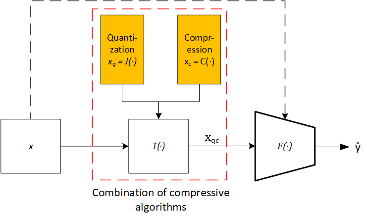

# Compression Supports Spatial Deep Learning

## Abstract
In the last decades, the domain of spatial computing became more and more data-driven, especially when using remote sensing-based images. Furthermore, the satellites provide huge amounts of images, so the number of available datasets is increasing. This leads to the need for large storage requirements and high computational costs when estimating the label scene classification problem using deep learning. This consumes and blocks important hardware recourses, energy, and time. In this paper, the use of aggressive compression algorithms will be discussed to cut the wasted transmission and resources for selected land cover classification problems. To compare the different compression methods and the classification performance, the satellite image patches are compressed by two methods. The first method is the image quantization of the data to reduce the bit depth. Second is the lossy and lossless compression of images with the use of image file formats, such as JPEG and TIFF. The performance of the classification is evaluated with the use of convolutional neural networks like VGG16. The experiments indicated that not all remote sensing image classification problems improve their performance when taking the full available information into account. Moreover, compression can set the focus on specific image features, leading to fewer storage needs and a reduction of computing time with comparably small costs in terms of quality and accuracy. All in all, quantization and embedding into file formats do support convolutional neural networks to estimate the labels of images, by strengthening the features.

*Figure 1: The pipeline of the experiment is to evaluate the impact of the two selected compression methods and their parameters in convolutional neural networks.*

## Setup
This project does use public datasets:
1. EuroSAT
2. RSI-CB256
3. AID

Those datasets need to be downloaded and split into three subsets, one training set (folder name: train), one validation set (folder name: val_0), and one test set (folder name: val_1). The path to those datasets needs to be adjusted in `./set_env.sh`.

Additionally, Docker should be available to run perform the training and deploy the models. 

## Run Experiments

## Citation
This project has been accepted to IEEE JSTARS and is currently in the publication process. 

Bibtex will be added as soon as the paper is online available. 